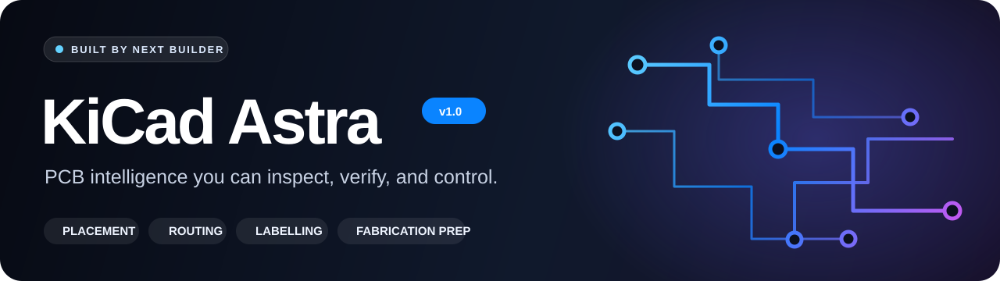
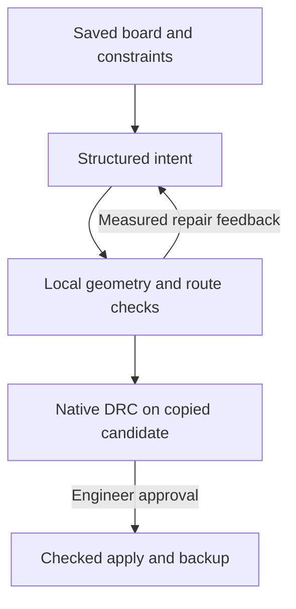

# KiCad Astra

<p align="center">
  <strong>Built by Next Builder</strong><br>
  <sub>Version 1.0 · inspectable automation for serious PCB work</sub>
</p>

**KiCad Astra is an AI-assisted PCB layout and manufacturing-preparation
workbench for KiCad.** It combines placement planning, deterministic local
routing, reference-label finishing, native DRC review and fabrication exports
inside one controlled desktop workflow.

KiCad Astra turns a saved PCB into a reviewable layout workflow. An optional
hosted model proposes placements or pad-to-pad connections. Local code checks
the geometry and builds routes. You inspect the result, run KiCad DRC, and
approve changes before they reach the board.

**Version `1.0.0` · Python 3.11+ · KiCad 10.0.6 reference target · MIT**

> [!IMPORTANT]
> This is an installable source release with offline, desktop and native CLI
> verification. Live editor/API acceptance and multi-platform installation
> checks remain open. Read [the verification record](VALIDATION.md), begin with
> a copy of a non-production board, and keep engineering review in the loop.

[Quick start](#quick-start) · [Install](#install-in-kicad) ·
[Workflow](#board-workflow) · [Developer core](#developer-guide) ·
[File map](PROJECT_STRUCTURE.md) · [Publish with a browser](GITHUB_LAUNCH.md)

## What you can do

| Capability | Current behavior |
| --- | --- |
| Inspect | Capture board geometry, pad/net identities, layers, locks and project constraints |
| Plan placement | Request component poses, inspect projected geometry, then approve placement separately |
| Route | Compile bounded same-net pad-pair requests using deterministic local A* and collision checks |
| Finish labels | Arrange visible reference labels with consistent size, stroke and spacing; preserve locked/hidden fields |
| Review | Inspect proposed changes, layout metrics, remaining issues and native DRC differences |
| Apply | Require a matching checked plan, fresh board state, backup and native transaction |
| Prepare fabrication | Strengthen copied project rules, run strict native DRC and export plot/reference files for review |
| Reproduce | Use offline examples, tests, diagnostics, JSON reports and deterministic source archives |

The router currently handles individual connections, with configurable
through-vias. Differential pairs, length matching, push-and-shove, impedance
or thermal simulation, vendor certification and automatic assembly signoff
are future work. See [the implementation scope](ROADMAP.md).

## Before you start

| Requirement | When needed |
| --- | --- |
| Python 3.12 with Tcl/Tk support | Reference setup for the desktop workbench; code accepts Python 3.11+ |
| KiCad 10.0.6 and its matching CLI | Native board capture/editing, DRC and fabrication; newer versions need compatibility checking |
| A desktop display | Graphical demo and workbench |
| A saved KiCad project | Native work: `.kicad_pcb`, matching `.kicad_pro`, rules and schematic |
| Internet for dependency installation | First setup unless you prepare a platform-specific offline package cache |
| OpenAI API key and compatible model access | Hosted-model planning only; credentials/access are not included |
| Git | Optional; ZIP users and browser-only GitHub publishers do not need it |

You can run the synthetic demo, local label arrangement and existing local
checks without an API key. The demo is software test geometry, not a functional
circuit. It does not edit a KiCad project.

## Download the project

On the repository page, open **Releases** and download
`kicad-astra-v1.0.0.zip` when the v1.0 release has been published. Alternatively,
use **Code → Download ZIP**
for the current branch. GitHub also generates source archives for tags and
commits. [GitHub download instructions](https://docs.github.com/en/repositories/working-with-files/using-files/downloading-source-code-archives)

Extract the download. Open a terminal **inside the folder containing
`README.md`, `main.py` and `plugin.json`**. Its name may be `kicad-astra`
or `kicad-astra-main`, depending on the download. Keep the full directory
structure together. A source download includes the code, not Python, KiCad,
installed dependencies, model credentials or an operating-system installer.

## Quick start

Start with the offline demo to verify your Python setup before connecting a
real board. Commands below assume the repository root. You can paste one
command at a time; stop and read an error before continuing.

### Windows — PowerShell

Install Python 3.12 with Tcl/Tk from your Python provider. Open PowerShell in
the extracted project folder, then run:

```powershell
py -3.12 --version
py -3.12 -m venv .venv
.\.venv\Scripts\python.exe -m pip install -r requirements.txt
.\.venv\Scripts\python.exe main.py --version
.\.venv\Scripts\python.exe main.py --doctor --check-gui
.\.venv\Scripts\python.exe -m examples.run_offline --output demo-session.json
.\.venv\Scripts\python.exe main.py --demo
```

What each step does:

| Step | Expected result |
| --- | --- |
| Check Python | A Python 3.12 version is printed |
| Create `.venv` | A project-local Python environment is created |
| Install requirements | The pinned runtime packages install into that environment |
| Print version | `KiCad Astra 1.0.0` |
| Run doctor | Per-check `pass`, `fail` or `not_run`; no board edits |
| Run headless demo | A `demo-session.json` report containing a synthetic compiled route |
| Open desktop demo | The KiCad Astra workbench displays the synthetic board and proposed route |

The commands call the environment's Python directly. PowerShell activation or
an execution-policy change is not required. KiCad/API checks can say `not_run`
in this demo setup; that status is not a failure or an integration pass.
If a required dependency or Tk check fails, use [Troubleshooting](#troubleshooting).

### Linux and macOS

Use a Python interpreter with `venv`, `pip` and Tkinter support:

```bash
python3 --version
python3 -m venv .venv
.venv/bin/python -m pip install -r requirements.txt
.venv/bin/python main.py --version
.venv/bin/python main.py --doctor --check-gui
.venv/bin/python -m examples.run_offline --output demo-session.json
.venv/bin/python main.py --demo
```

Choose Python 3.12 if several interpreters are installed. If Tkinter is missing,
install Tk support through the provider of that interpreter. A system Tk
package may not fix an unrelated custom Python build. A remote headless shell
can run the headless example, but the workbench needs a display.

### Explore the demo

Select a footprint to inspect its details. Use the wheel to zoom, drag to pan,
change the layer filter and toggle **Show proposal**. Open **Proposed changes**,
**Local checks** and **Session JSON** to inspect the result.

Select **Arrange reference labels**; choose `labels.example.json`, or cancel
the optional file chooser to use the same defaults. The preview shows proposed
reference positions. **Export session** saves the review data.

Native DRC, Apply and fabrication preparation are disabled in demo mode.
Pressing **Generate plan** with data sending enabled and a valid key can still
make a hosted-model request; opening the demo itself makes no such request.

## Install in KiCad

Install KiCad first and close any running KiCad Astra window. From the source
folder, preview the target and then install:

**Windows PowerShell**

```powershell
.\.venv\Scripts\python.exe scripts\install_plugin.py --dry-run
.\.venv\Scripts\python.exe scripts\install_plugin.py
```

**Linux/macOS**

```bash
.venv/bin/python scripts/install_plugin.py --dry-run
.venv/bin/python scripts/install_plugin.py
```

| OS | Default complete plugin folder |
| --- | --- |
| Windows | `C:\Users\<you>\Documents\KiCad\10.0\plugins\kicad-astra` |
| macOS | `~/Documents/KiCad/10.0/plugins/kicad-astra` |
| Linux | `~/.local/share/KiCad/10.0/plugins/kicad-astra` |

The installer accepts `KICAD_DOCUMENTS_HOME`, `--kicad-version` and a complete
`--destination` path. `--kicad-version 10.0` selects a folder; it does not install
KiCad or claim compatibility with another release. Example for redirected
Windows Documents, after checking your actual KiCad user-data directory:

```powershell
.\.venv\Scripts\python.exe scripts\install_plugin.py --destination "D:\KiCad\10.0\plugins\kicad-astra" --dry-run
.\.venv\Scripts\python.exe scripts\install_plugin.py --destination "D:\KiCad\10.0\plugins\kicad-astra"
```

Open/restart PCB Editor and find **Open KiCad Astra** in its plugin actions
preferences. Enable the action if needed and launch it from the editor.
KiCad creates a separate Python environment and installs this plugin's
requirements; allow that setup to finish. Your development `.venv` is not
copied. The selected interpreter must also include Tkinter. These behaviors
follow [KiCad's IPC plugin guide](https://dev-docs.kicad.org/en/apis-and-binding/ipc-api/for-addon-developers/index.html).

This repository uses KiCad's IPC plugin format. The source ZIP is installed
with the included script; it is not a Package and Content Manager archive.
Launching from KiCad supplies the connection context for the active editor.

### Upgrade, rollback and removal

From a newly extracted release, use the same installation destination:

```powershell
.\.venv\Scripts\python.exe scripts\install_plugin.py --upgrade --dry-run
.\.venv\Scripts\python.exe scripts\install_plugin.py --upgrade
```

Use `.venv/bin/python` on Linux/macOS. Upgrades preserve the previous folder
under `kicad-astra-plugin-backups/`; the installer prints its exact path.
A failed final installation move restores the previous folder. A foreign
plugin identifier is never overwritten.

After dependency changes, use **Recreate Plugin Environment** in the action's
context menu in PCB Editor preferences. To roll back, close the plugin, move
the new installation aside, restore the printed backup to the original plugin
path and recreate the environment. For removal, disable the action and remove
only that installation folder. Keep your source checkout and board backups
until you no longer need them.

The identity is `io.nextbuilder.kicadastra`. Disable an older differently identified
build before installing this one separately; no destructive name migration is
performed. Plugin backups and board backups serve different purposes.

## Configure hosted planning

Launch KiCad Astra from KiCad. Enter your API key in **API key (session only)**,
select the model and reasoning effort, and enable **Send board geometry and
design data to the OpenAI API** when ready to generate a plan. The masked field
is held in memory and not written to exported sessions.

`OPENAI_API_KEY`, if present in the launching process environment, takes
precedence over the UI key field. A variable set in one terminal is not
retroactively inherited by a KiCad instance already running elsewhere.

The code defaults to model ID `gpt-6-astra`; the technical identifier remains
unchanged by the KiCad Astra product branding. You can use `OPENAI_MODEL` or
the UI field to select an accessible compatible model. This client needs
Responses API reasoning parameters and strict structured outputs. A successful
metadata lookup does not prove successful generation or planning quality.
See [Structured Outputs](https://developers.openai.com/api/docs/guides/structured-outputs)
for the response format used by the client.

The board packet includes geometry, reference/value fields, nets, pad identities,
constraints and the objective. `store=False` is set on the API request; it is
not a claim that all provider processing or retention is disabled. Each request
has a 180-second timeout. Default repair settings permit up to three calls per
Generate/Revise sequence. Usage is shown in the session report. Cancelling an
in-flight request may not prevent its billing.

## Board workflow

Use a copy of a small, saved project for your first native run. Start from an
annotated schematic, update the PCB from it, and save the board/project/rules.
A valid closed `Edge.Cuts` outline, correct net assignments and usable
footprint geometry are prerequisites; a prompt cannot supply missing circuit
requirements reliably.

| Stage | Action | Inspect before proceeding |
| --- | --- | --- |
| Capture | **Capture board** | Counts, nets, pad positions, outline, layers and geometry errors |
| Constrain | Open **Constraints** and load/edit JSON | Locked connectors, placement regions, sensitive nets and actual dimensions |
| Place | Choose **Placement**, enter the objective, **Generate plan** | Proposed poses, original outlines, locality metrics and validation |
| Check | **Test with KiCad DRC** | New issues and remaining issues; revise if needed |
| Approve | **Apply checked plan** | Native changes, backup/audit output, then save in KiCad |
| Route | Recapture, choose **Routing**, generate/check/apply | Net endpoints, copper paths, widths, vias and engineering requirements |
| Finish | Save/recapture, **Arrange reference labels**, check/apply | Readability, silk/mask clearance, locked fields and actual appearance |
| Fabricate | Save/recapture, **Prepare fabrication…** | Strict native report, plot files and fabricator/assembly requirements |

Placement approval precedes routing. Avoid manual edits during the brief native
staging interval. Preview stages operations, saves a candidate, restores the
live board, then runs the longer CLI comparison on copies. Apply requires the
same checked operations and an unchanged snapshot; board or rule edits require
a fresh capture and check. Applied operations are grouped into a native undo
step; live Apply/Undo acceptance still needs verification on your installation.

**Incremental DRC acceptance means no new reported items.** Existing errors or
airwires can remain. Fabrication uses a separate strict gate requiring zero
reported items. Never treat the Apply button as fabrication approval.

Example placement objective:

> Place the unlocked components within the defined regions. Keep the connectors
> and mounting features fixed. Prioritize the explicit proximity constraints,
> and report missing requirements before proposing changes.

Example routing objective:

> Propose connections between the existing pads on these named low-speed nets.
> Preserve manual nets and existing copper. Report any connection the configured
> layers or rules cannot support.

Replace the scope with your actual circuit. The model's proposal is intent;
the local engine constructs and checks the resulting copper.

## Constraints and finishing profiles

[constraints.example.json](constraints.example.json) contains all layout
defaults. Partial JSON inherits omitted defaults. For example:

```json
{
  "fixed_references": ["J1", "SW1"],
  "manual_nets": ["USB_D+", "USB_D-", "RF_FEED"],
  "allow_vias": false,
  "track_width_mm": 0.25,
  "clearance_mm": 0.2
}
```

Use dimensions and names from your project and intended process. The sample
values are configuration examples, not electrical design recommendations.
Fixed prefixes default to `J`, `H` and `MH`; changing `fixed_references` alone
does not remove those prefix protections. Routes can be wider than a requested
floor when captured net classes or project minima require it.

| Profile | Controls | Full contract |
| --- | --- | --- |
| `constraints.example.json` | Routing dimensions, layer/via permissions, fixed/manual items, budgets, regions and proximity | [Configuration](docs/CONFIGURATION.md) |
| `labels.example.json` | Reference height, stroke, spacing, mask/edge margin, grid and maximum offset | [Finishing](docs/FINISHING_AND_FABRICATION.md) |
| `manufacturing.example.json` | Copper stack, thickness, native fabrication minima and schematic parity | [Fabrication](docs/FINISHING_AND_FABRICATION.md#fabrication-preparation) |

Reference arrangement preserves hidden/locked references, values and product
artwork. It uses same-side obstacles and conservative glyph bounds; unresolved
labels block application. It does not invent pinouts, polarity or ratings.
Label sessions can be exported for review; regenerate labels locally instead
of importing saved label operations as an approval.

**Layout quality** displays measured area, net-span/trace-length estimates and
readability/overlap findings. Those geometric measurements do not establish
signal integrity or a universal placement score.

## Fabrication output

Copy the manufacturing example and confirm its limits with your fabricator.
The default is a generic two-layer, 1.6 mm example requiring schematic parity.
A four-layer board needs its actual ordered copper layers, for example
`["F.Cu", "In1.Cu", "In2.Cu", "B.Cu"]`; changing the profile does not change the
board itself. Review copper weights, materials and impedance targets separately.

Save all project inputs, capture again, then choose **Prepare fabrication…**.
Select the profile and an output parent folder. KiCad Astra creates a new
folder, hashes and copies inputs, strengthens saved minima, refills copied
zones and runs native DRC. Checks reported as ignored are reenabled on the
copy and rerun. Any remaining reported item or disabled check blocks export.

For command-line use on Windows, adjust the real board/CLI paths:

```powershell
.\.venv\Scripts\python.exe -m kicad.manufacturing --board "C:\PCB\project.kicad_pcb" --profile manufacturing.example.json --output "C:\PCB\review-output-001" --cli "C:\Program Files\KiCad\10.0\bin\kicad-cli.exe"
```

Use `.venv/bin/python` and your CLI path on Linux/macOS. The output directory
must be new. A matching saved `.kicad_pro` is required. Parity also requires
a matching root `.kicad_sch` and a self-contained hierarchy.

| File/output | Purpose |
| --- | --- |
| `manufacturing-report.json` | Result, native findings, profile, statistics, hashes and remaining review |
| `source/` | Isolated copied project with strengthened rules and refilled zones |
| `fabrication/*.gbr` | Gerber X2 copper, mask, silk and board outline layers |
| `fabrication/*.drl` | Native Excellon drill outputs where required |
| `fabrication/placement.csv` | Both-side placement reference data, excluding DNP items |
| `fabrication/*.svg` | Separate fabrication/outline layer references |
| `fabrication/SHA256SUMS.json` | Generated output checksums |
| `kicad-astra-fabrication.zip` | Exported review package after the strict gate passes |

A blocked report keeps findings without a fabrication ZIP. A successful result
is `exported_for_review`; inspect every plot and complete engineer/fabricator
review before ordering. A verified BOM/MPNs, assembly variants, orientation,
product labels, paste stencils and vendor approval are not generated.
`assembly_ready` therefore remains false. Full limits and native rule-key
mappings are documented in [the fabrication reference](docs/FINISHING_AND_FABRICATION.md).

## Developer guide

### Source layout

The repository root contains the plugin manifest, entry point, dependency
files, profile examples and documentation. Python packages stay at the root so
KiCad and module commands resolve the same code.

| Path | Responsibility |
| --- | --- |
| `agent/` | Structured intent, Responses client, bounded repair and plan bundles |
| `kicad/` | Capture, geometry, constraints, placement/routing, labels, native DRC, transactions and fabrication |
| `ui/` | Tk workbench, worker event queue and interactive board preview |
| `support/` | Product/version constants and read-only diagnostics |
| `examples/` | Synthetic scene and headless demonstration |
| `tests/` | Local, property, adapter, process and opt-in integration checks |
| `scripts/` | Atomic installer, fixture generator, verifier and archive builder |
| `docs/` | Technical core, configuration, fabrication and testing references |
| `validation/` | Recorded development observations and packaging results |
| `.github/` | CI workflow, issue forms and pull-request template |

[PROJECT_STRUCTURE.md](PROJECT_STRUCTURE.md) lists every distributable file
with its role and explains the correct GitHub root layout.

### Technical core and trust boundaries



The model does not execute Python or supply trusted native copper operations.
Schema v2 restricts proposals to findings, placements, pad-pair connections and
unresolved items. Local JSON rejects unknown keys, non-finite values and mixed
placement/routing changes. Pad references for routing are stable UUIDs.

Geometry uses millimetres; native IPC uses integer nanometres. Adapters verify
returned operations, including partial/clamped results. Source fingerprints
and bundle hashes bind checks to a specific board and plan. Failed staging
rolls back. Imported routes and DRC receipts never authorize edits directly.

Worker threads communicate through a queue; Tk operations remain on the UI
thread. Cancellation stops subsequent work and unwinds transactions. It does
not terminate arbitrary Python threads or guarantee cancellation of an already
sent model request. Full protocol, A* search, geometry approximations, units,
hash and transaction contracts are in [ARCHITECTURE.md](docs/ARCHITECTURE.md).

### Runtime dependencies

| Package | Pin | Role |
| --- | --- | --- |
| `openai` | 2.54.0 | Hosted Responses client |
| `kicad-python` | 0.8.0 | KiCad IPC/protobuf wrappers |
| `shapely` | 2.1.2 | Geometric operations and collision checks |
| `numpy` | 2.3.5 | Numeric dependency compatibility |
| `jsonschema` | 4.26.0 | Strict proposal validation |

The pins are in [requirements.txt](requirements.txt). They describe the tested
runtime set, not a complete hash-locked dependency graph for every OS.
Tkinter comes from the selected Python installation. KiCad's `pcbnew` module
is used only by the native fixture generator; do not install an unrelated
registry package with that name for normal plugin operation.

### Tests and diagnostics

Install the development dependencies into your existing environment:

```powershell
.\.venv\Scripts\python.exe -m pip install -r requirements-dev.txt
.\.venv\Scripts\python.exe scripts\verify.py
```

On Linux/macOS use `.venv/bin/python`. The verifier runs syntax, Ruff lint and
format checks, pytest and coverage reporting. It writes fresh results under
`build/verification/`. The default excludes live integration execution through
explicit skips; skipped checks are never counted as passes.

For configured desktop/native environments:

```powershell
.\.venv\Scripts\python.exe scripts\verify.py --gui --native-cli
.\.venv\Scripts\python.exe scripts\verify.py --gui --native-cli --native --live-api --require-all
```

The second command needs a disposable fixture open in KiCad, working IPC and
an API key, and opts into a potentially billed synthetic API test. Read
[TESTING.md](docs/TESTING.md) before enabling it. `--require-all` fails if an
integration test is skipped. Read [VALIDATION.md](VALIDATION.md) for prior
observations, the blocked final combined run and outstanding acceptance.
The included GitHub workflow runs Python checks on Linux, Windows and macOS
after upload; it has not already executed in your repository.

Useful read-only diagnostics:

```powershell
.\.venv\Scripts\python.exe main.py --doctor --json
.\.venv\Scripts\python.exe main.py --doctor --check-gui
.\.venv\Scripts\python.exe main.py --doctor --connect
.\.venv\Scripts\python.exe main.py --doctor --check-api
```

`--connect` needs access to a running editor. `--check-api` uses the environment
key to retrieve model metadata; it sends no board packet and performs no
layout generation. A successful doctor exit describes only performed checks.

| Environment variable | Use |
| --- | --- |
| `OPENAI_API_KEY` | Optional environment key; takes precedence over UI input |
| `OPENAI_MODEL` | Default model for a newly started client/UI |
| `KICAD_DOCUMENTS_HOME` | Installer's KiCad user-data base directory |
| `KICAD_ASTRA_KICAD_CLI` | CLI path for diagnostics, headless fabrication and native tests |
| `KICAD_ASTRA_KICAD_PCBNEW_PYTHON` | Matching KiCad Python used to generate native test fixtures |

Normal editor transactions resolve the CLI from the active KiCad instance.
Do not put credentials in source, Git remotes, constraints, screenshots or bug
reports. If you share a session, review it for private board information.

### Build a downloadable release

```powershell
.\.venv\Scripts\python.exe scripts\build_release.py
Get-FileHash .\dist\kicad-astra-v1.0.0.zip -Algorithm SHA256
```

The builder uses only Python's standard library. It includes the full source,
documentation, GitHub metadata and per-file `SHA256SUMS.json`, with stable
entry ordering/timestamps. Environments, hidden caches, `build/`, `dist/` and
ZIP files are excluded. Inspect the source folder for unrelated files before
building. Identical source bytes in the same build environment produce the
same archive; new content/evidence changes the hash.

The generated checksum manifest belongs to the release ZIP and is ignored by
Git at the repository root to avoid stale checksums after later commits.
Checksums detect accidental changes; they are not a signed authenticity proof.
Publish the versioned asset using [GITHUB_LAUNCH.md](GITHUB_LAUNCH.md).

## Troubleshooting

| Symptom | Action |
| --- | --- |
| `py` or Python command is missing | Install/select Python 3.12 and reopen the terminal |
| `main.py` or requirements cannot be found | Open the extracted folder containing `plugin.json`; check the current directory |
| Missing Python package | Run pip with the same environment executable used to launch the program |
| Tkinter import/window failure | Use a Python build with Tcl/Tk and a desktop; run `--doctor --check-gui` |
| Plugin action is absent | Confirm the printed destination, restart PCB Editor, allow environment setup and inspect KiCad's plugin/status messages |
| Workbench cannot connect | Launch from the intended PCB Editor action; use the saved project and matching IPC context |
| Unsupported KiCad version | Use the required version; changing a folder name does not upgrade KiCad |
| Model unavailable or unauthorized | Check the actual API project's model access and selected identifier; metadata success does not prove generation |
| Geometry/outline errors | Fix missing/open outlines and unsupported geometry in KiCad, save and recapture |
| Route cannot be completed | Inspect obstacles, manual nets, layers, via permissions and budgets; route sensitive cases manually |
| Apply disabled or stale-plan error | Resolve local issues, run native DRC and recapture after any board/rule change |
| No clear label position | Adjust nearby artwork or references manually; hidden/locked fields are deliberately preserved |
| Fabrication asks for a save | Save the board and project, then capture them again |
| Fabrication blocked | Read the report, fix all remaining native items and verify stack/thickness/schematic parity |
| Output folder already exists | Choose a new folder; existing fabrication outputs are not replaced |
| Installer refuses an existing folder | Use `--upgrade` only for the same KiCad Astra identity and inspect its backup path |

For a bug report, include the product/KiCad/Python versions, OS, exact stage,
reproduction steps and relevant diagnostics. A small shareable synthetic board
is ideal. State whether the failure came from a mock, native CLI or live editor.

## Contributing, licensing and release status

Read [CONTRIBUTING.md](CONTRIBUTING.md) for environment setup, core contracts
and review expectations. [ROADMAP.md](ROADMAP.md) separates implemented
capabilities from planned work. [CHANGELOG.md](CHANGELOG.md) records the 1.0
release scope. Source code is available under the [MIT license](LICENSE); dependencies
and KiCad retain their own licenses and names.

To publish your own repository, follow [GITHUB_LAUNCH.md](GITHUB_LAUNCH.md).
Upload the extracted project contents with `README.md` and `plugin.json` at the
repository root. Attach the built ZIP to a release so users can download a
specific prepared version.

KiCad Astra is built by Next Builder as an independent open-source project. It
is not affiliated with or endorsed by the KiCad project or OpenAI. KiCad and
OpenAI product names and marks belong to their respective owners. Model/service
access and engineering approval remain separate from this source release.
