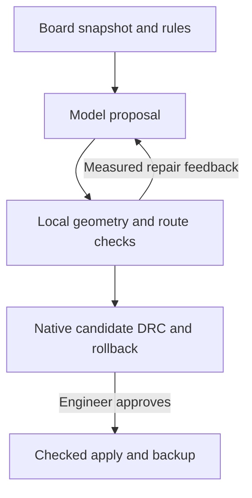

# KiCad Astra technical core

Implementation reference for 1.0.0. All commands and source paths assume
the repository root. Start with [the README](../README.md) for installation.

## Architecture



| Module | Responsibility |
| --- | --- |
| `main.py` | CLI parsing, diagnostics, startup errors, real/demo session selection |
| `support/doctor.py` | Read-only interpreter, dependencies, Tk, CLI, IPC, and model checks |
| `ui/assistant_panel.py` | Tk workbench, worker queue, cancellation, import/export, approval actions |
| `ui/board_preview.py` | Layer filtering, selection, pan/zoom, proposed geometry rendering |
| `agent/astra_client.py` | Bounded Responses requests, refusal/incomplete handling, usage accounting |
| `agent/prompts.py` | Instruction/data separation and complete board packet construction |
| `agent/tools.py` | Schema v2, duplicate-key rejection, finite-number validation, mode restrictions |
| `agent/workflow.py` | Evaluate proposals, compile connections, repair with measured feedback |
| `kicad/board_reader.py` | Native capture, geometry extraction, fingerprints, copies and backups |
| `kicad/config.py` | Validated explicit constraints and defaults |
| `kicad/geometry.py` | Polygon conversion, transforms, outline assembly, arc sampling |
| `kicad/validation.py` | Placement/routing legality, effective minima, metrics |
| `kicad/router.py` | Deterministic bounded multilayer A* and continuous segment collision tests |
| `kicad/placement.py` | Native footprint staging and returned-operation verification |
| `kicad/routing.py` | Native track/via construction and returned-operation verification |
| `kicad/labels.py` | Native text capture, deterministic reference arrangement and checked field updates |
| `kicad/quality.py` | Area, net-span, trace-length and readability observations |
| `kicad/manufacturing.py` | Stronger copied project rules, strict DRC, plot exports, integrity report and CLI |
| `kicad/drc.py` | Real CLI process lifecycle, report validation, issue multiset comparison |
| `kicad/transactions.py` | Advisory lock, rollback preview, checked apply, consumed receipts, audit |
| `scripts/` | Installation, reproducible archive, verification runner, native fixture generation |

Tk widgets are accessed on the UI thread. Workers report through a queue polled
by Tk. A worker cancellation event stops subsequent work; it is not a general
thread-kill mechanism. Session locking and a process-level advisory board lock
prevent cooperating KiCad Astra instances from interleaving native commits. The lock
does not lock out an engineer or other KiCad plugins.

## Proposal protocol and units

`agent/tools.py:PLAN_JSON_SCHEMA` is the protocol source of truth. Every object
rejects additional fields. The following empty plan is valid schema v2:

```json
{
  "schema_version": 2,
  "summary": "Review only",
  "findings": [],
  "placements": [],
  "connections": [],
  "unresolved": []
}
```

| Object | Required fields |
| --- | --- |
| Placement | `reference`, `x_mm`, `y_mm`, `rotation_deg`, `side`, `reason` |
| Connection | `net`, `from_pad_id`, `to_pad_id`, `layers`, `reason` |
| Finding | `severity`, `message`, `references` |

`side` is `front` or `back`; a placement cannot flip the captured side.
Connection endpoints must be distinct, existing pad UUIDs on the same nonempty
net. Pad labels such as `U1.3` are convenient for proximity constraints, but
routing uses UUIDs. The model never supplies native track IDs or executable
Python. Its strings and proposed operations remain untrusted input.

Coordinates, dimensions, and local Shapely geometry use **millimetres**.
KiCad IPC integer coordinates use **nanometres**; adapters convert at the
boundary using 1,000,000 nm/mm. Proposal rotations use degrees in KiCad's pose
convention; geometry transforms account for the board's downward Y direction.
Do not introduce a second coordinate reflection in a new adapter.

JSON NaN, infinity, exponent overflow, duplicate keys, mixed placement/routing,
unknown modes, unknown fields, and malformed constraints are rejected. Plans
are limited to 2,000,000 input characters; model board packets are limited to
1.5 MB by the snapshot packet builder. Geometry is not silently truncated to fit.

Import accepts an exported proposal/session, validates it against the current
capture, and **recomputes routes locally**. Imported route coordinates and DRC
receipts do not authorize native changes. Version 1 plans are incompatible.

## Geometry and placement core

Capture maps returned pad polygons by UUID, including sparse or reordered IPC
responses. It collects copper layers, footprints, pad copper, tracks, arcs,
vias, holes, zones, keepouts, effective net classes, and saved project minima.
Board outline loops and cutouts are assembled into a valid polygon. Open or
ambiguous outlines produce actionable errors.

Placement projection moves owned pads, courtyards, holes, and supported copper
children with the footprint pose. Checks include:

- Locked, fixed, grouped, or unsupported movable footprints.
- Existing track/via attachment that would be broken by a move.
- Maximum displacement, board containment, side-specific courtyards.
- Copper/drill clearance, rule-area restrictions, placement-region containment.
- Explicit pad proximity constraints and actual pad geometry after rotation.

3D model metadata is preserved by supported native updates. Estimated net span
is half-perimeter wire length, a placement proxy. It is not routed length,
impedance, delay, current capacity, or a proof of optimal placement.

Curves use a nominal 0.005 mm chord tolerance. Zone envelopes, some graphic
bounds, slotted drill disks, and existing via layer coverage are conservative
approximations. These can reject legal designs. Custom KiCad rule semantics
remain the responsibility of the native checker. Unknown essential geometry
must block editing; extensions should preserve this behavior.

## Routing core

The router handles a bounded list of individual same-net pad-pair connections.
It validates pad identities and allowed layers, combines configured dimensions
with captured effective minima, and constructs clearance-inflated obstacles.
It first accepts unobstructed orthogonal/45-degree direct routes when possible.
Otherwise it searches `(grid_x, grid_y, layer, heading)` states using A*.

Eight planar directions provide orthogonal and diagonal moves. Edge cost
includes distance and a small bend penalty. A via transition adds
`via_cost_mm`. A Euclidean distance estimate guides the search. Exact pad
anchors are connected to nearby grid states with continuous collision checks;
short endpoint escape segments may use other angles. Segments are checked
across their full length, so legal endpoints do not imply a legal diagonal.

When enabled, a through-via must clear obstacles on **every captured copper
layer**, including layers not requested for planar routing. Supported native
vias span F.Cu to B.Cu. Blind, buried, microvias and unsupported via-in-pad
transitions are not generated. Previously compiled routes are added to the
scene so later connections account for new copper. There is no rip-up/retry
optimizer over the entire board.

Search has node and time budgets; checks are sampled during expansion and may
overshoot the node limit by a small batch. Geometry preparation is outside the
search timeout. Identical inputs and seed produce stable generated IDs and
routing behavior in the pinned environment. Routes are not claimed globally
shortest, electrically optimal, or guaranteed to exist on the chosen grid.

There is no push-and-shove, differential-pair coupling, length tuning,
impedance/current/thermal solver, automatic decoupling inference, 3D enclosure
collision check, or guaranteed all-airwire completion. Put sensitive nets in
`manual_nets` and route them using the required engineering constraints.

## API request and repair loop

The client sends a Responses API request with `store=False`, strict JSON Schema,
`max_output_tokens=16000`, and reasoning effort `high` by default. The UI
supports `low`, `medium`, `high`, and `xhigh`. It does not set temperature.
Each request times out after 180 seconds; transport retries are disabled.

The packet includes board geometry, references/values, pad/net identities,
constraints, the objective, and relevant revision feedback. Enabling board-data
sending is required in the UI. `store=False` is a request setting, not a promise
that all service-side processing/retention is disabled.

Local schema or geometry errors feed a bounded repair loop. Repeated identical
invalid proposals stop the loop early. A revision cannot silently drop a
previously requested connection; endpoint reversal still refers to the same
pair. An explicit new scoped request can change the task.

Default maximum usage is one initial request plus two repairs. Each manual
Generate/Revise starts a new sequence. There is no monetary budget manager.
Token counts record returned usage; they cannot account for an interrupted
request whose response was never received. Cancel prevents subsequent work,
but an in-flight request may finish and be billed. Refusals, incomplete
responses, transport failures, and malformed output do not authorize edits.

## Native transaction contract

A snapshot fingerprint covers the board document, document identity, saved
project/rule files, and captured net classes. A bundle content hash covers the
proposal, constraints, and compiled result. Capture consistency is checked
before and after reading. Save project-rule changes before capture.

**Preview:** acquire locks → verify snapshot → save baseline/project copy →
begin commit → stage verified operations → capture/save candidate → drop commit
in `finally` → verify restored snapshot → run baseline and candidate CLI DRC.
The long CLI jobs run after the live board has been restored.

The candidate file must match the staged document and include project settings.
A KiCad build that does not expose staged changes or save an identical copy
causes an explicit preflight failure. There is no unchecked Apply action.
Native stage verification checks returned item count/IDs and relevant poses,
layers, widths, drill dimensions and through-via span. Server-clamped or partial
results must not be accepted as the requested operation.

DRC report handling removes stale reports, accepts only expected process exit
codes, validates report/category structure, and compares a multiset of issue
identities. It considers category, type, severity, description, and affected
item identities; merely reducing the total issue count is insufficient.
Timeout/cancellation terminates and reaps the CLI process. Each copy has a
180-second DRC timeout.

**Apply:** verify a fresh successful receipt and current snapshot → create
backup → recheck snapshot → stage the same operations → compare the exact
candidate digest → push one undo commit → consume receipt → write audit.
A changed board, plan, rules, or native output blocks application. Exceptions
before a successful push drop the commit. A receipt cannot be reused.

Board backups live next to the design under
`kicad-astra-backups/<timestamp>/<board>.kicad_pcb`, with project settings and an
`.kicad-astra-audit.json` report. Audit failure after a successful commit is reported
as a warning, because the board was already changed. Apply does not save the
edited live PCB automatically. Inspect and save in KiCad; verify one-step Undo
on your platform during acceptance testing.

See [Configuration](CONFIGURATION.md), [Finishing and fabrication](FINISHING_AND_FABRICATION.md), and [Testing](TESTING.md) for the corresponding contracts.
